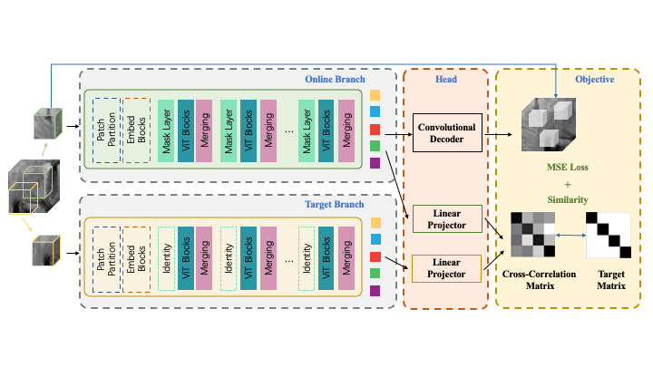

# Grid-Mask-Modeling
This is the Pytorch implement of our 

**GMiM: Adaptive and Hierarchical Self-supervised Pre-Training for 3D Medical Image Segmentation**

Our code is heavily based on [Swin UNETER](https://monai.io/research/swin-unetr) and MONAI. Thanks for open source.

# Model Overview
The architecture of our method is illustrated below: It consists of two branches, and learned representations from multi-pretext tasks.




# Installing Dependencies
Dependencies can be installed using:
``` bash
conda env create -n <env_name> -f conda.yml
```
or using:
``` bash
pip install -r requirements.txt
```

# Pre-trained Models

We use [Swin UNETER](https://monai.io/research/swin-unetr) as our baseline and provide the self-supervised pre-trained encoder, named SwinViT in this <a href="https://drive.google.com/file/d/1r7nipy-Uph4cu8ZSA9TGaDUpVB7sIrNd/view?usp=drive_link"> amos_link</a>. and <a href="https://drive.google.com/file/d/1_XzS-nx4W5JGq6nfbI6sIQWUHldWYpIg/view?usp=drive_link"> brats_link</a>. 

In the following, we describe how to pre-train, finetune, and train from scratch.

# Datasets

The following datasets were used for pre-training. The corresponding json files of each dataset for more details can be in ```jsons``` folder:

- Amos 2022 ([Link](https://amos22.grand-challenge.org/)) ([Download json](./Amos22/jsons/amos22_folds.json))
- Lung Nodule Analysis 2016 (LUNA 16) ([Link](https://luna16.grand-challenge.org/Data/)) ([Download json](./Pretrain/jsons/luna.json))
- BraTS 2021 ([Link](http://braintumorsegmentation.org/)) ([Download json](./BraTS21/jsons/brats21_folds.json))
- MSD ([Link](http://medicaldecathlon.com/)) 


# Training
Our experiments use a single 80G A100 gpu. To pretrain a `Swin UNETR` encoder:

## Single GPU Training 
To train from scratch a `Swin UNETR` encoder using a single gpu with gradient-checkpointing and a specified patch size:
### BraTs 2021
```bash
python ./BraTS21/run.py \
--json_list=./BraTS21/jsons/brats21_folds.json \
--data_dir=./dataset/BraTS2021 \
--logdir=<logdir> \
--fold=<fold> \
--batch_size=<batch_size>
```

### Amos 2022
```bash
python ./Amos22/run.py \
--json_list=./GMM/Amos22/jsons/amos22_folds.json \
--data_dir=./dataset/AMOS22 \
--logdir=<logdir> \
--fold=<fold> \
--batch_size=<batch_size>
```

## Single GPU Pre-training
### BraTs 2021
```bash
python ./Pretrain/run_ssl.py \
--datasets=PretrainDatasetMR \
--json_list=./Pretrain/jsons/pre_brats21.json \
--data_dir=<data_dir> \
--in_channels=4 \
--num_steps=3000 \
--lrdecay \
--eval_num=200 \
--dynamic_masking \
--decay=1e-5 \
--basic_mask_ratio=0.5 \
--scale=0.3 \
--drop_ratio=0.3 \
--hierarchical_masking=0.5 \
--invis_patches \
--logdir=<log_dir>
```

### Amos 2022
```bash
python ./Pretrain/run_ssl.py \
--datasets=PretrainDatasetCT \
--json_list=./GMM/Pretrain/jsons/pre_ct.json \
--in_channels=1 \
--num_steps=4000 \
--lrdecay \
--eval_num=200 \
--dynamic_masking \
--decay=1e-5 \
--basic_mask_ratio=0.5 \
--scale=0.3 \
--drop_ratio=0.3 \
--hierarchical_masking=0.5 \
--invis_patches \
--logdir=<log_dir>
```

## Single GPU Fine-tune
### BraTs 2021
```bash
python ./BraTS21/run.py \
--json_list=./BraTS21/jsons/brats21_folds.json \
--data_dir=./dataset/BraTS2021 \
--logdir=<logdir> \
--fold=<fold> \
--batch_size=<batch_size> \
--pretrained_encoder=<pretrained_encoder> 
```

### Amos 2022
```bash
python ./Amos22/run.py \
--json_list=./GMM/Amos22/jsons/amos22_folds.json \
--data_dir=./dataset/AMOS22 \
--logdir=<logdir> \
--fold=<fold> \
--batch_size=<batch_size> \
--pretrained_encoder=<pretrained_encoder> 
```

## Single GPU Test
### BraTs 2021
```bash
python ./BraTS21/test.py \
--json_list=./BraTS21/jsons/brats21_folds.json \
--data_dir=<data_dir> \
--output_dir=<output_dir> \
--fold=0 \
--pretrained_dir=<pretrained_dir> \
--best_model=<best_model>
```

### Amos 2022
```bash
python ./Amos22/test.py \
--json_list=./Amos22/jsons/amos22_folds.json \
--data_dir=<data_dir> \
--output_dir=<output_dir> \
--fold=0 \
--pretrained_dir=<pretrained_dir> \
--best_model=<best_model>
```

# Citation
If you find this repository useful, please consider citing our paper:


